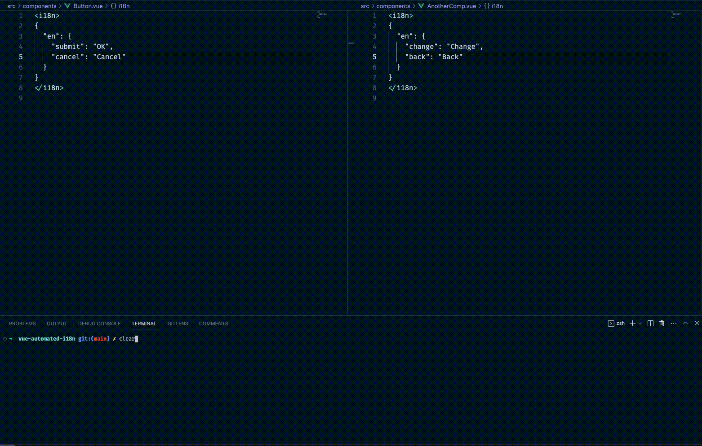

# vue-automated-i18n

## 📚 Introduction

This repository automates Vue SFC locales in the i18n custom block, which processes importing locales from JSON, exporting locales to JSON, adding new fields, or adding new locale options.

## ⚒️ Used Technologies

- @vue/compiler-sfc
- Yargs
- Prettier

## Getting Started

For using the project follow the steps below

### Installation

You can clone the project with the following URL.

```bash
git clone https://github.com/trombonist76/vue-automated-i18n.git
```

```bash
yarn
```

## Script Usages

### **A. Adding New Locale**

> Script: **`yarn add-locale`** 

> Example: **`yarn add-locale --localeKey az --extendKey tr`**

> Shorthand **`yarn add-locale -l az -e tr`**

| Builder Opts.  | Alias      | Default		  		  | Required	|	Example 			 | Description 																							                            |
| -------------- | --------   | ----------------- | --------- | -------------- | ------------------------------------------------------------------------------------ |
| localeKey      | `-l`       | `none`            | `true`    |  tr            | New locale option to be added to the component.                                      |
| extendKey      | `-e`       | `none`            | `false`   |  en            | The locale whose translations will be transferred to new locale.                     |
| dir            | `-d`       | `src/components`  | `false`   |  -             | The components directory or path that will be added to new locale.                   |


### **B. Adding New Field to Component**

NOTE: You can add nested fields with using (.) dot. Ex: this.is.nested `{ this: { is: { nested: givenValue }}}`

> Script: **`yarn add-field`** 

> Example: **`yarn add-field --component Button --fieldName submit --fieldValue OK`**

> Nested - Example: **`yarn add-field --component Header --fieldName title.header --fieldValue "Header Title"`**

> Shorthand **`yarn add-field -c Button -f submit -v OK`**

| Builder Opts.  | Alias      | Default		  		  | Required	|	Example 			 | Description 																							                            |
| -------------- | --------   | ----------------- | --------- | -------------- | ------------------------------------------------------------------------------------ |
| component      | `-c`       | `none`            | `true`    |  Button        | The component name, without the '.vue', to which a new field will be added.          |
| fieldName      | `-f`       | `none`            | `true`    |  newField      | The field name to be added to component as a object key.                             |
| fieldValue     | `-v`       | `none`            | `true`    |  hi, im value  | The field value of the new field to be added to component as a object value.         |


### **C. Adding New Field to All Components**

NOTE: You can add nested fields with using (.) dot. Ex: this.is.nested `{ this: { is: { nested: givenValue }}}`

> Script: **`yarn add-field-all`** 

> Example: **`yarn add-field-all --fieldName submit --fieldValue OK --dir src/components`**

> Nested - Example: **`yarn add-field-all --fieldName title.header --fieldValue "Header Title" --dir src/components`**

> Shorthand **`yarn add-field-all -f submit -v OK -d src/components`**

| Builder Opts.  | Alias      | Default		  		  | Required	|	Example 			 | Description 																							                            |
| -------------- | --------   | ----------------- | --------- | -------------- | ------------------------------------------------------------------------------------ |
| fieldName      | `-f`       | `none`            | `true`    |  newField      | The field name to be added to component as a object key.                             |
| fieldValue     | `-v`       | `none`            | `true`    |  hi, im value  | The field value of the new field to be added to component as a object value.         |
| dir            | `-d`       | `src/components`  | `false`   |  src/views     | The components directory or path that will be added to new field.                    |



### **D. Importing locales from JSON**

NOTE: The JSON file must be like this:

```json
{
	"src/components/Button": {
		"en": {
			"submit": "OK"
		},
		"tr": {
			"submit": "tamam"
		},
	},
	"src/components/Header": {
		"en": {
			"title": "Header Title"
		},
		"tr": {
			"title": "Header Başlığı"
		},
	}
	// and other files
}
```

> Script: **`yarn import-locales`** 

> Example: **`yarn import-locales --importFilePath src/imports/locales.json --dir src/components`**

> Shorthand **`yarn import-locales -p src/imports/locales.json -d src/components`**

| Builder Opts.  | Alias      | Default		  		  | Required	|	Example 			            | Description 																							                           |
| -------------- | --------   | ----------------- | --------- | ------------------------- | ------------------------------------------------------------------------------------ |
| importFilePath | `-p`       | `none`            | `true`    |  import/locales.json      | The path of JSON file to be imported its translations to components.                 |
| dir            | `-d`       | `src/components`  | `false`   |  src/views                | The components directory or path that will be added to locales from JSON.            |


### **E. Exporting locales from JSON**

> Script: **`yarn export-locales`** 

> Example: **`yarn export-locales --exportFilePath src/exports/locales.json --dir src/components`**

> Shorthand **`yarn export-locales -p src/exports/locales.json -d src/components`**

| Builder Opts.  | Alias      | Default		  		    | Required	|	Example 			         | Description 																						                              |
| -------------- | --------   | -----------------   | --------- | ---------------------- | ------------------------------------------------------------------------------------ |
| exportFilePath | `-p`       | `translations.json` | `false`   | export/locales.json    | The path of JSON file to be exported components translations.                        |
| dir            | `-d`       | `src/components`    | `false`   | src/views              | The components directory or path that will be added to locales from JSON.            |
| component      | `-c`       | `none`              | `false`   | Header         | The specific component name, without the '.vue', to which its translations will be exported. |


